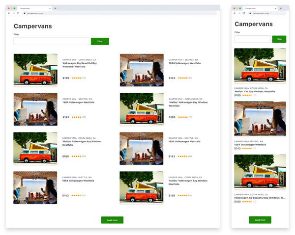

# Outdoorsy Frontend Coding Challenge

Thanks for applying for a frontend role at Outdoorsy. We've put together this code challenge, which should take around 4 hours to complete.

## Functionality
The task is to develop a web app using Outdoorsy rentals API. Users should be taken to a list of campervans then be able to navigate to a campervan detail page. Users should be able to type keywords into a text field to filter the API results to find relevant campervans. Finish by pushing your code to Github and deploying your code to Heroku or another hosting environment.

### Frontend
At Outdoorsy, we primarily use two frontend technologies Next.js and Ember.js. We have created a starter project for both technologies. Choose either a starter project or if you would like to use another technology, please feel free.

#### Visual design
We have provided a design wireframe for the list view and the detail view. Please elaborate on the wireframes and make the design your own.

#### Endpoint documentation

##### GET Rental List
*URL:*
GET https://odc-search-staging.herokuapp.com/rentals?filter[type]=camper-van

*Query parameters:*
Required: `filters[keywords]` - a space-separated string of search terms
Optional: `page[limit]` - an integer that sets requested maximum result count
Optional: `page[offset]` - an integer that sets the index of the first result
(Example: a "third page" of 8 results would have a limit of 8, offset of 16)

##### GET Single Rental
*URL* GET [https://odc-search-staging.herokuapp.com/rentals/<RENTAL_ID>](https://odc-search-staging.herokuapp.com/rentals/2000)

*Response:*
The `data` object is an array of rental results.
Find name of rental at `data[].attributes.name`
Find primary image URL of rental by getting the ID from `data[].relationships.primary_image.data.id` and finding the matching `id` with `type: images` from the `included` array. The image URL is at `included[].attributes.url`.

### Notes
- Write production ready code.
- Please make frequent, and descriptive git commits.
- Use third-party libraries or not; your choice.
- The project should look good on a mobile device as well as a desktop.
- Please add some tests.
- Feel free to add functionality as you have time, but the feature described above is the priority.

### What we're looking for
- The functionality of the project matches the description above
- Visual design mostly matches designs (you're not required to be pixel perfect since the specs are rough)
- An ability to think through all potential states
- Code design and style should be consistent and reasonable

Thank you, and please reach out if you have any questions!

### Campervan list mockup

### Campervan detail mockup

